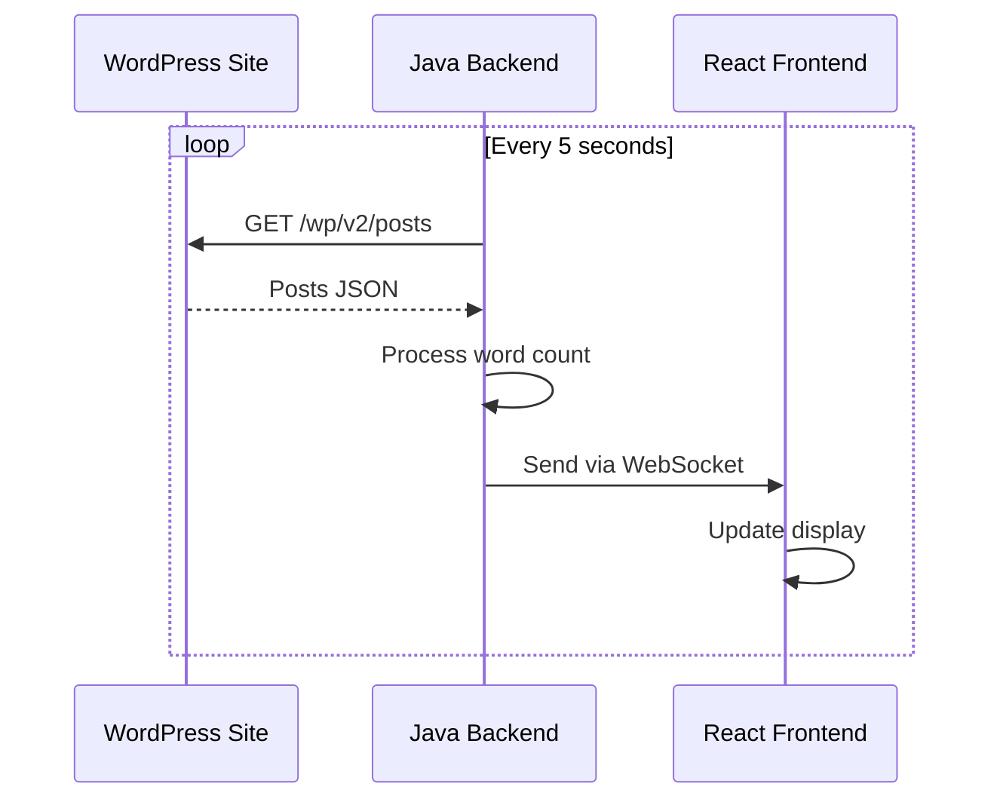

# README - Blog Word Counter System

## Backend (Java Spring Boot)

This is the backend service for the Blog Word Counter System that processes WordPress blog posts and provides real-time word count statistics.

### Prerequisites

- Java 17 or higher
- Maven
- Spring Boot 3.x

### Setup and Installation

1. Clone the repository
2. Configure application.properties:
    
    ```
    wordpress.api.url=https://www.thekey.academy/
    server.port=8080
    ```
    
3. Run the application:
    
    ```bash
    ./gradlew bootRun
    ```
    

### Key Features

- WordPress API integration
- Real-time word count processing
- WebSocket communication
- Automated post fetching every 5 seconds

## Frontend (React)

This is the frontend application that displays real-time word count statistics from WordPress blog posts.

### Prerequisites

- Node.js 18+
- npm or yarn
- React 18.x

### Setup and Installation

1. Clone the repository (can be skipped if already cloned with backend module)
2. Install dependencies:
    
    ```bash
    npm install
    # or
    yarn install
    ```
    
3. Start the development server:
    
    ```bash
    npm start
    # or
    yarn start
    ```
    

### Key Features

- Real-time word count display
- Automatic updates via WebSocket

## System Architecture

The system uses a WebSocket connection for real-time communication between the backend and frontend. The backend fetches blog posts from WordPress API, processes them to count words, and broadcasts the results to all connected clients.



### API Endpoints

- WebSocket: ws://localhost:8080/ws
- WordPress API: https://www.thekey.academy/wp-json/wp/v2/posts

<aside>
Note: Make sure both backend and frontend applications are running for the system to work properly. The backend should be started before the frontend to ensure WebSocket availability.

</aside>

## Testing

After launching both the backend and frontend applications, navigate to http://localhost:3000/ to verify the system output.